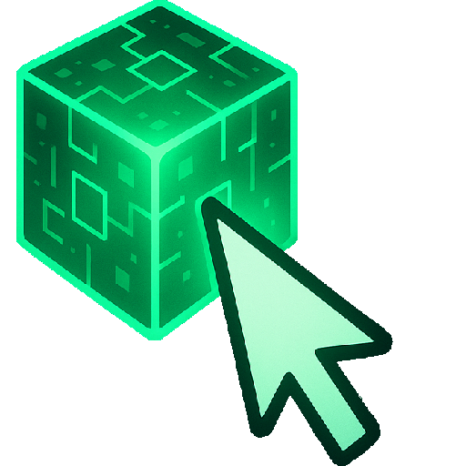

  

# Console Idle

**An idle hacking game played inside a computer terminal.**

You are an agent who has just joined a network run by G.A.I.A., a hostile AI.
You build up a computer, write software, run bots, and fight G.A.I.A. for
control of the world map. Progress keeps running while you are away.

**Play it:** [Console Idle on CrazyGames](https://www.crazygames.com/game/console-idle)

---

## At a glance

| | |
|---|---|
| Genre | Idle / incremental, with auto battles |
| Platform | Web browser |
| Released on | CrazyGames, with earlier builds on itch.io and a GameMonetize build |
| Current version | 1.0.4 |
| Built by | One person: design, code, balance and UI |
| Size | About 52,000 lines of JavaScript, 6,000 lines of CSS |

---

## What the player does

### Build a machine
Buy CPUs, GPUs and RAM. Each part adds power, and each part adds heat. A
performance panel shows the load and temperature of every part, so the player
has to balance speed against cooling.

### Craft components from logic gates
Components are assembled from AND, OR, NOT, NAND, NOR, XOR and XNOR gates.

### Run bots
Automation bots do repeated work for the player. Battle bots go out to fight.
A bot manager assigns them, upgrades them, and tracks what each one earns.

### Fight G.A.I.A. across a world map
G.A.I.A. attacks with its own set of moves: cracking passwords, fake
certificates, chaining, blocking and observation. The player takes regions of
the map back by sending battle bots. Each region has its own difficulty and its
own farming state.

### Format and start again, stronger
Formatting is the prestige system. The player wipes the machine and keeps
permanent upgrades chosen from a format tree. Each run goes further than the
last.

### And around that core
Tasks, timed events, an online store, a trade center, achievements, battle
logs, and a settings panel where the player recolors the whole terminal.

---

## Tech stack

| Piece | Choice |
|---|---|
| Language | JavaScript, no framework |
| DOM | jQuery |
| Background work | Web Worker for battle simulation |
| Save data | Browser storage, the CrazyGames data SDK, and export and import of a save file |
| Platform SDK | CrazyGames SDK v3: gameplay events and ads |
| Art | Credited icons from game-icons.net and OpenGameArt, CC BY |

---

## Engineering challenges worth reading about

**1. Battles run off the main thread.**
A battle is many units firing on their own timers. The simulation runs in a Web
Worker that steps the fight in fixed ticks and sends the result back, so the
terminal stays responsive while a fight runs.

**2. Time away still counts.**
An idle game has to reward the player for closing it. When the player returns,
the game measures the time that passed and hands it to the same worker, which
replays the battles for that period in one pass. Offline and online progress
come from one simulation, so they cannot disagree.

**3. A save file that survives updates.**
The game shipped more than thirty versions, and each one added new state. An old
save has none of the new fields. On load, the game walks the default state tree
and adds any missing keys to the player's save, at any depth, without touching
what the player already earned.

**4. One change, many screens.**
Buying one part can change the hardware table, the systems view, the performance
graph, and what is now unlocked in the store. A central observer maps each game
event to every screen and unlock it affects, so a new feature hooks in at one
place instead of many.

**5. Balance over a long curve.**
Idle games deal in numbers that grow for weeks. Item data is planned in a
spreadsheet before it goes into the game, and every large number is shortened
for display so it still reads at a glance.

**6. Shipping to a real platform.**
Publishing on CrazyGames meant meeting its rules: report when gameplay starts
and stops, save through its data service, and place ads where they do not break
play. The build is also packed down to a small set of files for upload.

---

## What I would do differently

This was my first large project, and I built it to learn by shipping. The code
works and the game is live, but it grew as one large script with a lot of shared
global state and repeated logic. Today I would split it into modules, keep the
game state in one typed store, and cover the balance math with tests. My later
work, such as TruePunch, is built that way.

---

## Related work

- [TruePunch web dashboard](https://github.com/MangoFlavor11/TruePunch-Showcase)
- [TruePunch Android app](https://github.com/MangoFlavor11/TruePunchApp-Showcase)

---

## Note

The source is private. This file is the guided tour for anyone reviewing the
work.
